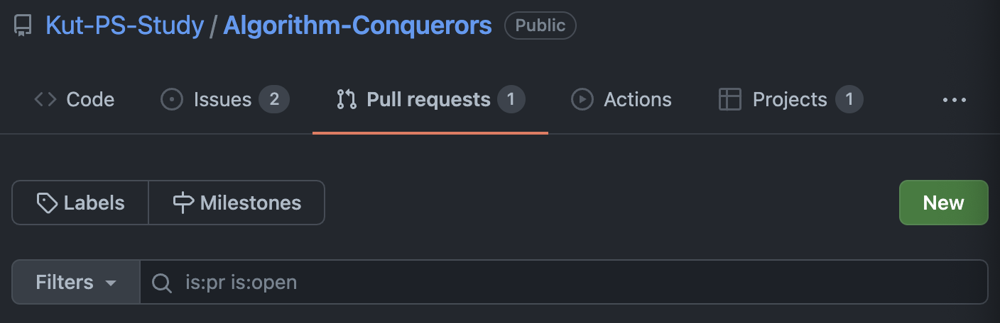
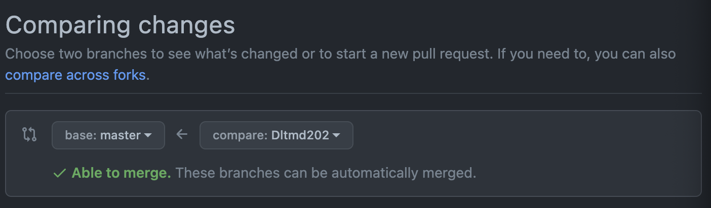
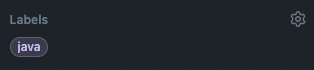
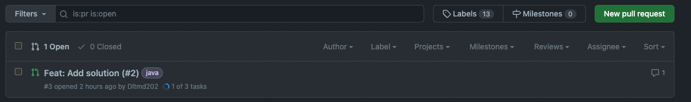
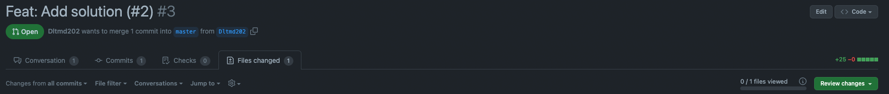
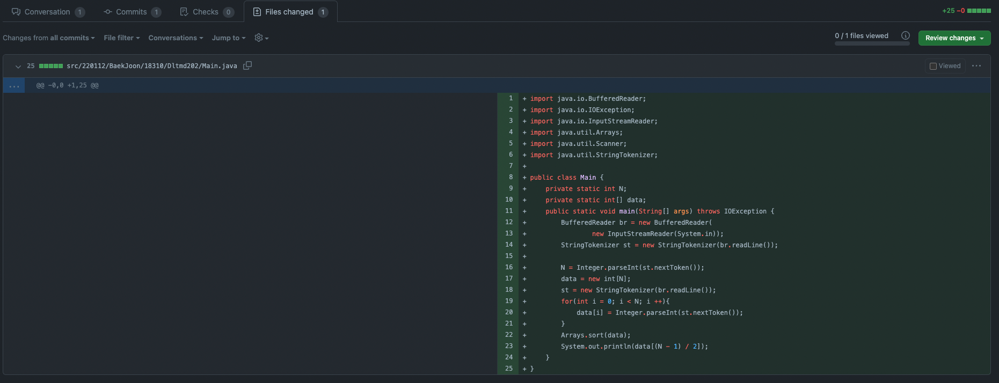
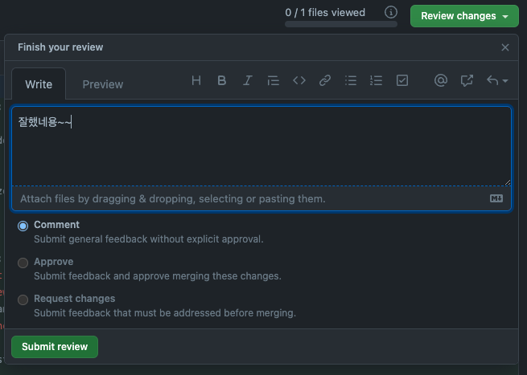

## 참여방법

#### 폴더 구조
- `src/{알고리즘출처}/{깃허브ID}/{문제 번호}/[mM]ain.${type}` 형식입니다.  
- 예시 : `src/BaekJoon/Dltmd202/1001/Main.java`
- 예시 : `src/Programmers/Dltmd202/1/main.cpp`
- 예시 : `src/LeetCode/Dltmd202/42748/main.py`

#### 초기설정 - clone
```bash
git clone https://github.com/Kut-PS-Study/Algorithm-Conquerors.git
git branch -M {깃허브ID}
git push -u origin {깃허브ID}
```

#### 코드 올리기
```bash
git add {matcher}
git commit -m "Feat: Add solution of #id"
git pull origin master
git push 
```

#### Pull Request
* `New` 버튼 누르기




* `계정 브랜치`에서 `master`로 `Pull request`



* PR 템플릿에 맞춰 작성하기
```markdown
## #{id} 문제풀이

## 세부 사항
- [ ] #{id} `상`
- [ ] #{id} `중`
- [ ] #{id} `하`

## 관련 이슈
- #{id}

## 코드


## 참고
> Reference는 옵션입니다! 참고사항이 없을 시 모두 지워주세요
- {설명} : {url}
```

* 해결에 사용한 언어 태그 `Labels` 에 달아주기



#### Merge 기준
- PR 후 1일 뒤
- 제출상 문제가 없을 때
- 저장소 관리가가 직접
> 리뷰를 좀 더 원하시는 분들은 요청해주시면 됩니다.

## 리뷰하는 방법
- PR을 선택하기



- `Files chnaged` 를 선택한다.



- 수정된 파일을 확인하며 `Viewed` 버튼을 클릭해준다.



- 코멘트, 개선, 수정 요청 등을 `markdown` 포맷의 코멘트와 체출한다.




## Tip
- 한 문제를 여러가지 방법으로 풀도록 탐구해보기
- 30분~60분 까지 고민해 본다.
- 어려우면 솔루션을 찾아본다.
- 참고한 부분은 PR 참고사항에 반영해준다.
